# AeroLumen Quad: A Versatile Quadcopter

### Team Members
- **Tanya Tripathi** (21BPS1595)
- **Saumitya Pareek** (21BPS1408)
- **Mohit Subramaniam** (21BPS1617)

### Supervisor
- **Dr. V. Muthumanikandan**

---

## Project Overview

AeroLumen Quad is a multi-functional quadcopter designed for versatile applications, such as aerial surveillance, environmental monitoring, and dynamic light shows. It integrates advanced flight control using the Pixhawk flight controller, wireless communication through the ESP32 microcontroller, and visual feedback via a piezo LED strip.

---

## Features
- **Advanced Flight Control**: Autonomous waypoint navigation and manual control.
- **Wireless Communication**: Real-time data transmission using the ESP32 microcontroller.
- **Dynamic Visual Effects**: Customizable lighting effects using a piezo LED strip for enhanced visibility and creative applications.
- **Versatility**: Capable of aerial surveillance, environmental monitoring, and light shows.

---
## Gallery

<p align="center">
  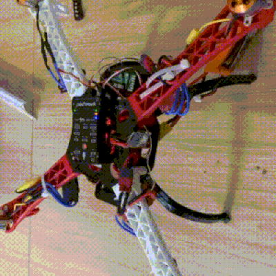
  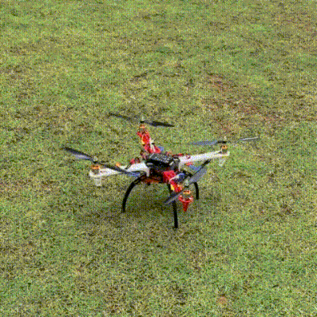
  
</p>

<p align="center">
  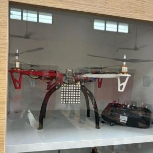
  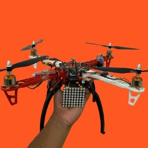
  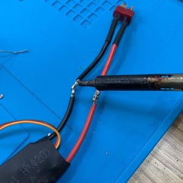
  
  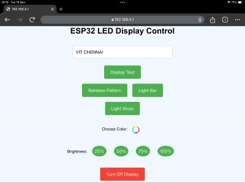
  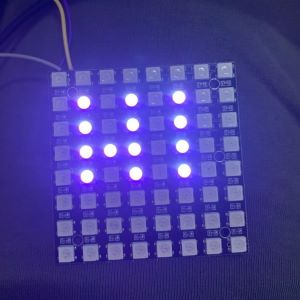
</p>


---

## Components
| Component                        | Image                                      | Functionality                                                                                  |
|----------------------------------|--------------------------------------------|------------------------------------------------------------------------------------------------|
| A2212 1400KV Brushless Motor     | 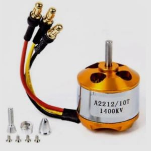                 | Provides thrust for stable flight.                                                              |
| 10x4.5 Propellers                | 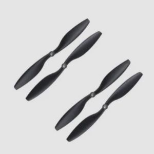         | Generates lift for maneuvering the quadcopter.                                                  |
| Electronic Speed Controllers (ESCs)| 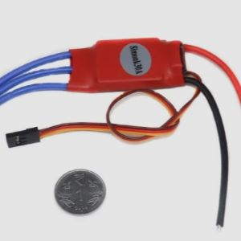                     | Controls motor speed for stable flight.                                                         |
| **Pixhawk Flight Controller**    | 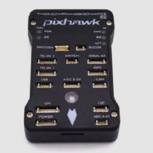             | Manages flight control, stability, and navigation.                                              |
| **ESP32 Microcontroller**        | 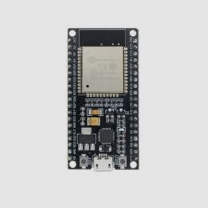                 | Handles wireless communication and sensor integration.                                          |
| Piezo LED Strip                  | 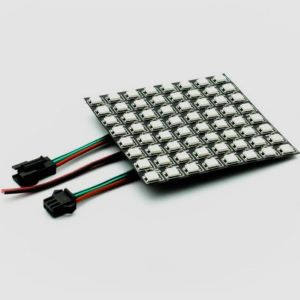               | Provides lighting for signaling and visual effects.                                             |
| 3S LiPo Battery                  | 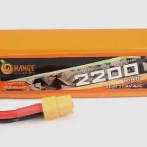             | Powers the motors and electronics.                                                              |
| GPS Module                       | 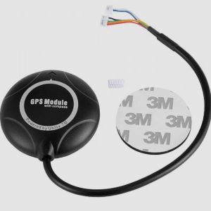                     | Enables navigation and autonomous flight.                                                       |
| Telemetry Module                 | 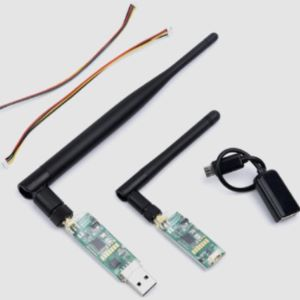         | Sends real-time flight data to the ground station.                                              |


---

## Assembly and Setup

### 1. **Assembly**
- Attach the motors and propellers to the quadcopter frame.
- Mount the ESCs and connect them to the respective motors.
- Install the Pixhawk flight controller at the center of the frame.
- Integrate the ESP32 microcontroller for wireless communication.
- Attach the piezo LED strip for visual feedback.

### 2. **Calibration**
- Use mission planning software like QGroundControl for Pixhawk calibration (accelerometer, gyroscope, ESC, and compass).
- Pair the radio controller with the Pixhawk.

### 3. **Programming**
- Implement flight control logic using mission planning software.
- Program the ESP32 using Arduino IDE for communication protocols and LED control.

### 4. **Testing**
- Conduct initial flight tests to ensure stability.
- Fine-tune PID settings for optimal performance.
- Test ESP32's wireless communication for real-time data streaming.

---

## Methodology
1. **Flight Dynamics**: Managed by the Pixhawk flight controller for stability and responsiveness.
2. **Wireless Communication**: ESP32 microcontroller transmits sensor data and receives control commands.
3. **Lighting Effects**: The piezo LED strip provides visual feedback during flights, particularly useful in low-light conditions.

---

## Unique Features
- **Integrated ESP32 for Wireless Communication**: Expands functionality with real-time data transmission and additional sensor integration.
- **Dynamic Lighting with Piezo LED Strip**: Enhances visibility and enables creative applications like light shows.
- **Advanced Flight Control**: Pixhawk supports both manual and autonomous flight, making it suitable for various missions.

---

## Applications
- **Emergency Response**: Provides aerial views and data in search and rescue missions.
- **Agriculture**: Monitors crop health and surveys large fields.
- **Security and Surveillance**: Suitable for patrolling large areas or monitoring borders.
- **Research and Data Collection**: Ideal for environmental studies and atmospheric data collection.
- **Entertainment**: Can be used in light shows and aerial displays for events.

---

## Earthquake Assistance UAV Drone (Application)

This project involves designing a quadcopter UAV aimed at assisting people trapped during earthquakes. It provides visual guidance using an 8x8 NeoPixel LED matrix and is manually controlled via QGroundControl (QGC), utilizing the PX4 Pro flight control software.

### 📋 Project Overview

- **Flight Controller Software**: [PX4 Pro](https://px4.io/)
- **Ground Control**: [QGroundControl (QGC)](https://docs.qgroundcontrol.com/en/)
- **Primary Function**: Assist in navigating earthquake-stricken areas and guide trapped individuals using visual signals on an 8x8 LED matrix display.

### 📏 Key Calculations

#### 1. Thrust Calculation
- Total thrust (T_total) = weight of the drone + payload capacity
- Weight of drone = 1200 grams
- Thrust per motor = 850 grams
- Total thrust = 4 × 850 = 3400 grams

#### 2. Payload Capacity Calculation
- Payload capacity (P_load) = total thrust - weight of the drone
- P_load = 3400 - 1200 = 2200 grams

#### 3. Flight Time Estimation
- Battery capacity = 2200 mAh
- Average current draw = 15A
- Estimated flight time = (2200 × 60) / 15000 ≈ 8.8 minutes

#### 4. Propeller Selection
- Propeller size = 10x4.5 inches
- Thrust per propeller = 850 grams

---


# ESP32 LED Matrix Display Project 🎨

Create a dynamic LED matrix display with the ESP32 microcontroller, allowing remote control through a web interface! This project enables users to display text, activate lighting patterns, and adjust brightness in real time.

---

## Implementation Explanation

This project leverages the **ESP32** microcontroller to control a **NeoPixel 8x8 LED matrix display**. Users can connect to the ESP32's WiFi access point and use a web-based interface to manage the display settings. The ESP32 runs as a standalone access point, enabling remote control from any WiFi-enabled device.

---

## 📦 Libraries and Constants

```cpp
#include <Adafruit_NeoPixel.h>
#include <WiFi.h>
#include <WebServer.h>

#define LED_PIN 27
#define NUM_LEDS 64
```

- **Adafruit_NeoPixel**: Library for controlling NeoPixel LED displays.
- **WiFi** and **WebServer**: Libraries for handling ESP32's WiFi capabilities and serving a web interface.
- **LED_PIN**: The GPIO pin connected to the LED strip.
- **NUM_LEDS**: Total number of LEDs in the matrix.

---

## 📡 WiFi Access Point Setup

```cpp
const char* ssid = "ESP32_LED_Display";
const char* password = "123456789";

WiFi.softAP(ssid, password);
```

The ESP32 is configured as an access point:
- **SSID**: "ESP32_LED_Display"
- **Password**: "123456789"

This allows users to connect directly to the ESP32 network to control the LED display.

---

## 🖼️ LED Matrix Character Map

```cpp
const uint8_t charMap[40][8] = {
  // Each 8-byte array represents a character's binary map for the LED matrix.
};
```

The **charMap** array stores binary data for each character in the display. Each 8-byte array corresponds to one character, defining its display pattern on the 8x8 LED matrix.

---

## 🌐 Web Server Configuration

### Web Page Design

The ESP32 hosts a simple **HTML page with JavaScript** that includes buttons and controls for:
- **Displaying text**
- **Turning off the display**
- **Selecting colors and patterns**
- **Adjusting brightness**

```cpp
server.on("/", HTTP_GET, []() {
  String page = "<html>..."; // HTML and JavaScript for the control page
  server.send(200, "text/html", page);
});
```

This **root endpoint ("/")** serves the control page where users can interact with the LED matrix.

---

### 🎛️ Control Actions

#### 1. Text Display
Display custom text on the LED matrix.

```cpp
server.on("/displayText", HTTP_GET, []() {
  inputText = server.arg("text").toUpperCase();
});
```

- **Description**: Converts input text to uppercase and sends it to the display.

#### 2. Turn Off Display
Turn off all LEDs on the matrix.

```cpp
server.on("/turnOff", HTTP_GET, []() {
  displayOn = false;
});
```

- **Description**: Deactivates the LED matrix display.

#### 3. Light Bar & Color Selection
Activate a light bar with a custom color.

```cpp
server.on("/lightBar", HTTP_GET, []() {
  lightBarColor = strtol(server.arg("color").c_str(), NULL, 16);
  lightBar = true;
});
```

- **Description**: Sets a chosen color on the LED matrix in a light bar pattern.

#### 4. Light Show
Start an animated light show.

```cpp
server.on("/lightShow", HTTP_GET, []() {
  lightShow = true;
});
```

- **Description**: Activates a predefined light show with cycling patterns.

#### 5. Rainbow Pattern 🌈
Generate a colorful rainbow effect on the LED matrix.

```cpp
void rainbowPattern() {
  // Implementation of rainbow pattern here
}
```

- **Description**: Creates a mesmerizing rainbow effect across the LED matrix.

---

## 🔧 Full Code

You can find the complete code for this project in the following file: [ESP32_LED_Matrix_Display.ino](esp_comms.ino).

---

## 💡 Getting Started

1. **Connect**: Set up your ESP32 and connect to the "ESP32_LED_Display" network.
2. **Open Browser**: Go to the ESP32’s IP address in a web browser.
3. **Control**: Use the web page to display text, toggle effects, and adjust settings on your LED matrix!

---

### 📘 Additional Resources
- [Adafruit NeoPixel Library Documentation](https://learn.adafruit.com/adafruit-neopixel-uberguide)
- [ESP32 Web Server Setup Guide](https://randomnerdtutorials.com/esp32-web-server-arduino-ide/)

---

## Future Enhancements
- Integration of additional sensors (e.g., thermal cameras, air quality sensors) for expanded monitoring capabilities.
- Development of a mobile application for enhanced control and real-time data visualization.

---
# 🚁 Advanced Quadcopter Control and Simulation Framework

---

## 📜 **Project Overview**  
This repository presents the design and implementation of an advanced quadcopter control system using MATLAB Simulink. The system is meticulously engineered to tackle key challenges in unmanned aerial vehicle (UAV) operations, such as stability, environmental disturbances, and efficient battery usage. By integrating robust control mechanisms and a comprehensive simulation environment, this project lays the groundwork for both real-world UAV applications and further research.  

---
## 👥 **Team Members**  
- **Mohit Subramaniam (21BPS1617)**  
- **Tanya Tripathi (21BPS1595)**
---
<p align="center">
  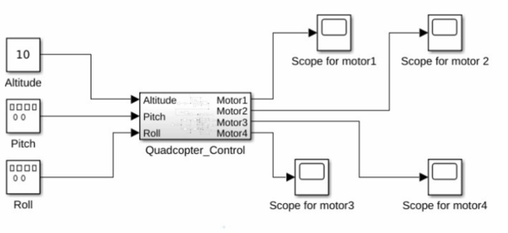
    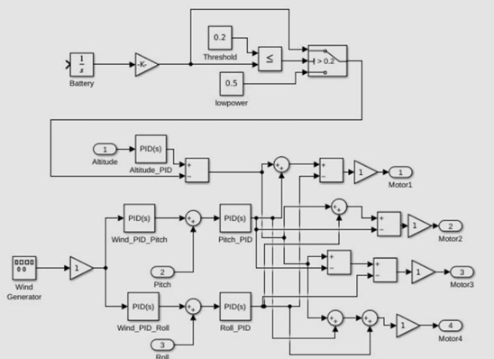

</p>

## ✨ **Key Features**  
### 1. **Motor Control System**  
- 🛠 Implements three PID controllers for precise altitude, pitch, and roll regulation.  
- 📏 Ensures stability and responsiveness during flight by dynamically adjusting motor thrust.  
- 🔧 Tuned PID parameters:  
  - **Altitude Control**: P = 2, I = 0.5, D = 0.1.  
  - **Pitch and Roll Control**: Manages differential thrust for smooth directional movements.
<p align="center">
  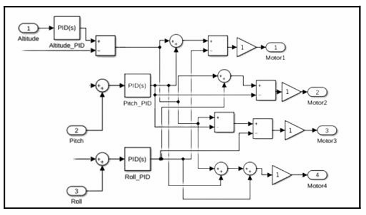
</p>

### 2. **Wind Disturbance Compensation**  
- 🌬 Simulates realistic wind gusts using a sinusoidal signal generator in Simulink.  
- 🎯 Uses additional PID controllers for pitch and roll to counteract disturbances.  
- ⚙️ Gain adjustment allows testing under varying wind intensities, ensuring robust performance outdoors.  
<p align="center">
  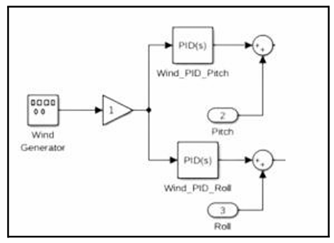
</p>

### 3. **Battery Monitoring and Efficiency Management**  
- 🔋 Simulates battery discharge based on motor thrust demands using an integrator block.  
- ⚡ Activates a **Low-Power Mode** when battery levels drop below a predefined threshold (e.g., 20%).  
- 🕒 Conserves energy by limiting non-critical functions, extending flight time, and enabling safe landings.
<p align="center">
  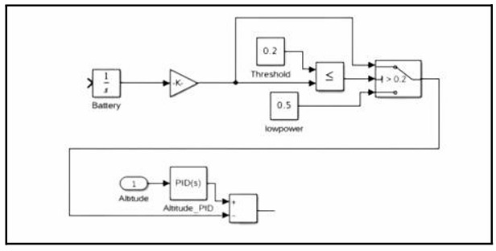
</p>
---

## 🔍 **How It Works**  
### **Subsystems**  
1. **Motor Control Subsystem**  
   - Balances altitude, pitch, and roll to stabilize the quadcopter in real-time.  
   - Combines PID outputs to provide precise motor thrust commands.  

2. **Wind Compensation Subsystem**  
   - Neutralizes simulated wind gusts using corrective control signals for pitch and roll.  
   - Adjustable gain block scales the strength of disturbances for testing and optimization.

3. **Battery Management Subsystem**  
   - Continuously monitors power levels to simulate real-time battery depletion.  
   - Triggers a low-power state to prioritize essential operations, extending flight duration.

---

## 🛠 **System Architecture**  
### Inputs  
- **Altitude Setpoint**: Desired height of the quadcopter.  
- **Pitch and Roll Setpoints**: Define orientation for directional movements.  
- **Wind Generator Input**: Simulates environmental disturbances.  

### Outputs  
- **Motor Thrust Commands**: Individual thrust values for all four motors.
- **Battery Status**: Indicates remaining battery power and triggers low-power mode when needed.
<p align="center">
  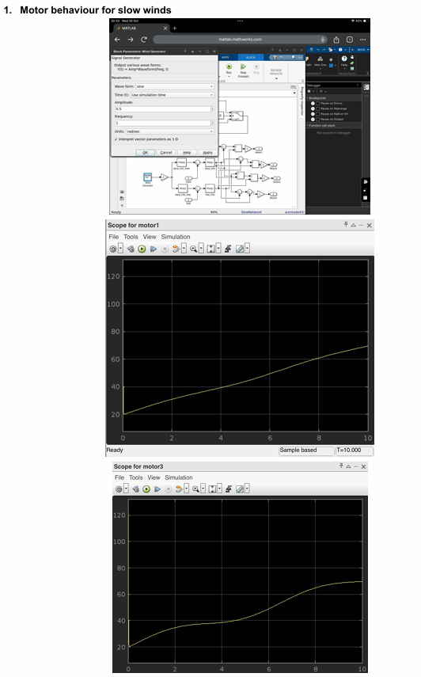
    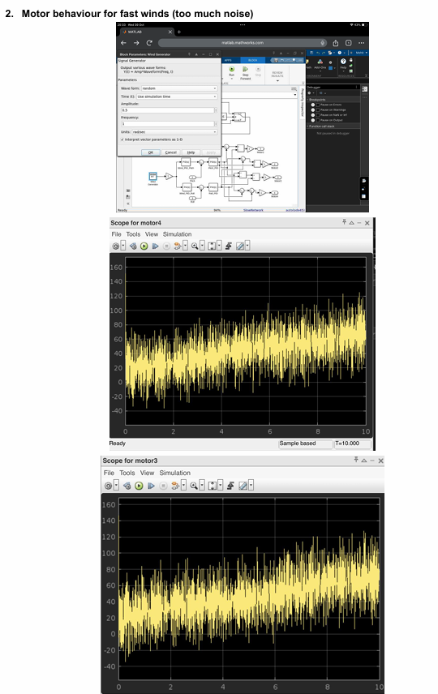

</p>
---

## 🌟 **Applications**  
- **Aerial Surveillance**: Provides stable and controlled flight for observation and monitoring tasks.  
- **Delivery Systems**: Ensures reliable navigation and performance in challenging environmental conditions.  
- **Research and Development**: Serves as a modular platform for UAV system design and testing.  

---

## 📊 **Results**  
### Performance Highlights  
1. **Stable Altitude Control**: Maintains precise height adjustments with minimal drift.  
2. **Wind Compensation**: Demonstrated effective handling of varying wind intensities during simulations.  
3. **Battery Optimization**: Successfully extended flight time by dynamically managing power usage.  

### Visualization  
- **Motor Behavior**: Observed consistent thrust adjustments under slow and fast wind conditions.  
- **Battery Monitoring**: Visualized battery depletion and activation of low-power mode.

---

## ✅ **Conclusion**  
This project delivers a robust, scalable framework for quadcopter control and simulation, combining key subsystems for motor control, wind compensation, and battery efficiency. By addressing real-world challenges in UAV operations, this system paves the way for innovative applications in areas such as aerial surveillance, logistics, and environmental monitoring. The modular design enables future enhancements, making it a valuable asset for advancing UAV technology.

---
## Contributing
Contributions are welcome! Submit a pull request or open an issue for improvements.

---

## Acknowledgments
- **School of Computer Science Engineering**, Cyber Physical Systems specialization.
- Special thanks to **Dr. V. Muthumanikandan** for guidance throughout this project.

---

## Contact
- Tanya Tripathi - [Email](mailto:tanyatripathi134340@gmail.com)
- Saumitya Pareek - [Email](mailto:saumityapareek@gmail.com)
- Mohit Subramaniam - [Email](mailto:mohitsubramaniam@gmail.com)
